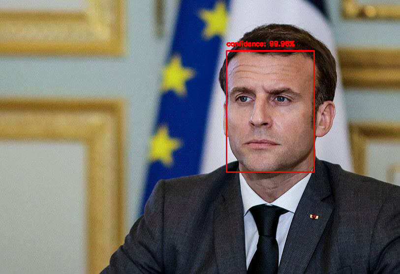

# face-detection-ssd-caffe

Face detection in still images using openCV and SSD with a pretrained caffe model.

## usage

Copy the Google Colab notebook to your Google Drive and launch it. Simple as that!  

Please follow the instructions and update your opencv installation to the latest.

## Contact

[Contact the author](mailto:georgios.ouzounis@gmail.com)
